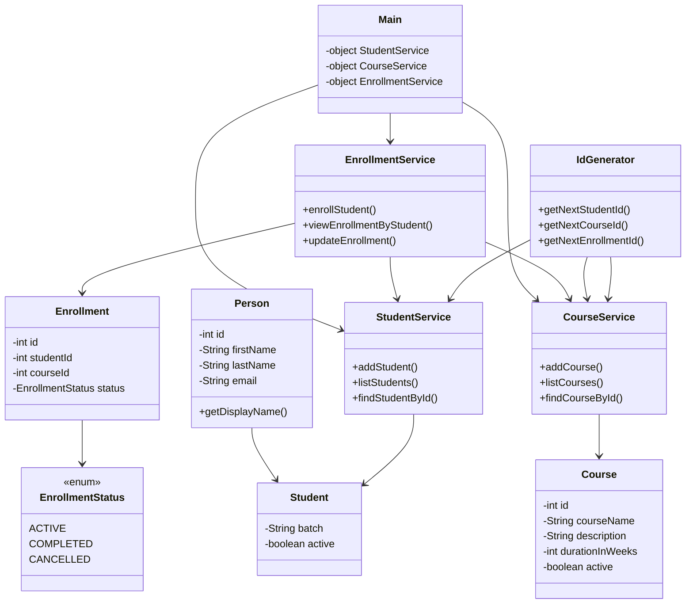

# LearnTrack - Student & Course Management System

## Project Description
LearnTrack is a **console-based Java application** designed to manage Students, Courses, and Enrollments.
This project is built using **Core Java concepts** and focuses on practicing fundamental programming skills and object-oriented design.

The system allows users to:
* Add and manage students
* Add and manage courses
* Enroll students into courses

## Key Concepts Covered
* Java Basics (variables, loops, conditionals)
* Object-Oriented Programming (Encapsulation, Inheritance, Polymorphism)
* Collections (ArrayList)
* Exception Handling (Custom Exceptions)
* Enums (for status handling)
* Clean Code & Modular Design

## How to Compile and Run

### Prerequisites
* Java JDK installed (version 8 or above)
* Environment variable `JAVA_HOME` configured
* Refer Setup_Instructions.md

### Compile the Project
Navigate to your project root directory and run:
we must compile all java files together
In Java, when compiling from command line, all dependent classes must be compiled together or available in classpath. Otherwise, the compiler throws “package does not exist” errors.

```bash
javac com/airtribe/learntrack/*.java      --> for Singe folder
javac com/airtribe/learntrack/**/*.java   --> for multiple folder
```

If not works due to Shell Script
Try this: 
```bash
javac -d . (Get-ChildItem -Recurse -Filter *.java src | ForEach-Object { $_.FullName })
```

### Run the Application
Once Main.class is created after compilation
```bash
java com.airtribe.learntrack.Main
```

### Sample Menu
```
==== MAIN MENU ====
1. Student
2. Course
3. Enrollment
0. Exit
```
## Class Diagram

Below is a simplified class diagram showing the relationships between core components in the LearnTrack system:


---

## Relationship Explanation

* **Inheritance**
  Student extends Person, reusing common fields like name and email.

* **Service to Entity Relationship**
  Each service class manages its respective entity using in-memory storage:

    * StudentService --> Student
    * CourseService --> Course
    * EnrollmentService --> Enrollment

* **Service Dependencies**
  EnrollmentService depends on:

    * StudentService
    * CourseService
      to validate student and course before enrollment.

* **Enum Usage**
  EnrollmentStatus is used to ensure only valid status values (ACTIVE, COMPLETED, CANCELLED).

* **Utility Class**
  IdGenerator provides unique IDs using static methods across the application.

---


## Features

1. Menu-driven console application
2. In-memory data storage using ArrayList
3. Input validation and error handling 
4. Clean separation of concerns (entity, service, UI)
5. Reusable utility classes

## Future Enhancements

* Database integration (MySQL/PostgreSQL)
* REST API version (Spring Boot)
* UI version (Web/React)
* Search & filtering features

## Author
Lokesh Jayaprakash
|Java | Backend Enthusiast | System Design| Automation|

