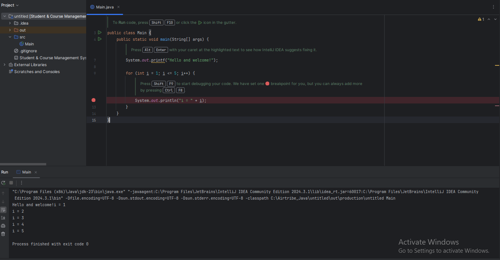

**JDK version used:**
    Check Java version by Java --version in Terminal 

Expected Response:
    java 11.0.26 2025-01-21 LTS
    Java(TM) SE Runtime Environment 18.9 (build 11.0.26+7-LTS-187)
    Java HotSpot(TM) 64-Bit Server VM 18.9 (build 11.0.26+7-LTS-187, mixed mode)

**Brief explanation of “Hello World” program run:**
1. Create New Java Project 'Student course Management System'
2. src/Main.java path contains Hello and welcome! Program
3. Execute it check able to results in Console

Expected Response:
